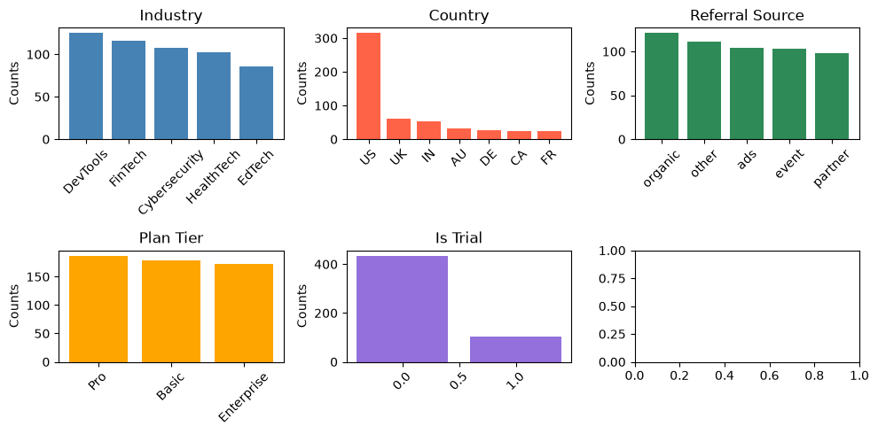
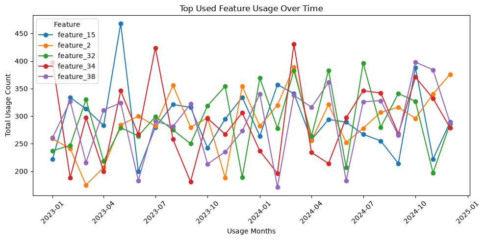
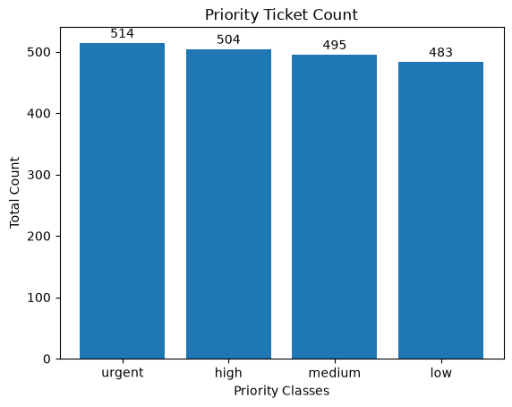
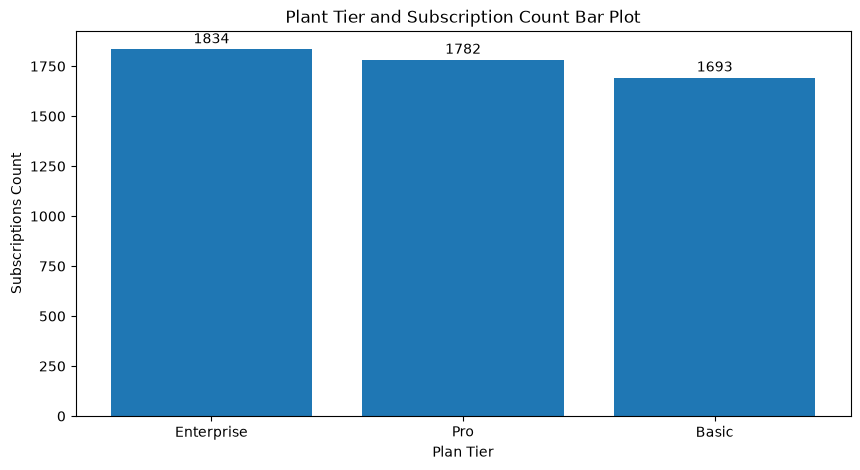
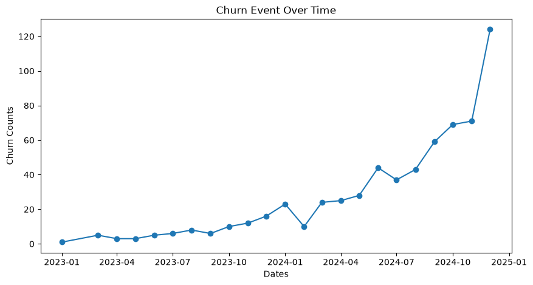

# ETL

This folder contains the notebook-based data preparation and exploratory analysis workflow for the SaaS growth and retention project.

## Files

| File | Purpose |
| --- | --- |
| `etl1_clean.ipynb` | Loads raw CSV files, profiles each table, fixes data quality issues, and exports cleaned datasets to `../data/cleaned/`. |
| `etl2_eda.ipynb` | Uses the cleaned datasets for exploratory analysis across accounts, feature usage, support tickets, subscriptions, and churn events. |
| `assets/` | README visuals extracted from existing notebook outputs. These charts were not regenerated separately. |

## ETL 1: Cleaning Workflow

`etl1_clean.ipynb` reads the raw CSVs from `../data/raw/`, assigns each file to a dataframe, and checks each dataset with `.head()`, `.shape`, null counts, duplicate counts, `.info()`, and `.describe()`.

Main cleaning steps:

| Dataset | Cleaning Actions |
| --- | --- |
| Accounts | Filled missing `industry` and `country` values using matching `account_name` records, then removed duplicate rows. |
| Churn Events | Inspected missing `reason_code`, found duplicate account/date churn records, kept the more complete churn event record, and dropped remaining duplicates. |
| Feature Usage | Investigated missing `feature_name`, removed duplicate subscription/date records where the duplicate record was less complete, and dropped remaining duplicates. |
| Subscriptions | Converted active missing `end_date` values to `Ongoing`, marked unresolved churned missing end dates as unknown, removed less complete duplicate subscription records, and dropped remaining duplicates. |
| Support Tickets | Removed incomplete duplicate tickets, mapped unknown satisfaction scores to `-1`, and corrected negative `resolution_time_hours` by using absolute values. |

Cleaned outputs:

| Output File | Rows |
| --- | ---: |
| `../data/cleaned/accounts_cleaned.csv` | 537 |
| `../data/cleaned/churn_events_cleaned.csv` | 632 |
| `../data/cleaned/feature_usage_cleaned.csv` | 26,653 |
| `../data/cleaned/subscriptions_cleaned.csv` | 5,309 |
| `../data/cleaned/support_tickets_cleaned.csv` | 1,996 |

## ETL 2: Exploratory Analysis

`etl2_eda.ipynb` analyzes the cleaned data by asking business questions for each table, creating grouped summaries, and plotting trends or category comparisons.

### Accounts

The account analysis compares industries, countries, referral sources, plan tiers, trial usage, seat counts, signup timing, and churn rates.

Key findings from the notebook:

- About 58% of non-churned customers are from the US.
- Basic, Pro, and Enterprise plan tiers are used at broadly similar levels.
- Most customers are paid users rather than trial users.
- Signup volume increases over time.
- No single category showed a strong churn-rate spike in this pass.

### Feature Usage

The feature analysis identifies the highest-usage features, how usage changes over time, average usage duration, error volume, beta-feature error behavior, and subscriptions with the widest feature variety.

Key findings from the notebook:

- The most-used features are not necessarily the features with the highest average usage duration.
- Feature 34 and Feature 2 appear among high-usage features and also have high error counts.
- Beta features show a higher error rate than non-beta features.

### Support Tickets

The support analysis reviews ticket volume over time, priority mix, resolution time by priority, satisfaction, escalation rate, and high-ticket accounts.

Key findings from the notebook:

- Ticket submissions trend upward over time.
- Urgent tickets have the highest ticket count, followed by high, medium, and low.
- High-priority tickets take the longest to resolve on average.
- Faster first response time was not clearly associated with higher satisfaction in this analysis.

### Subscriptions

The subscription analysis looks at plan distribution, MRR/ARR by tier, subscription length, trial versus non-trial churn, churn factors, and upgrade/downgrade revenue differences.

Key findings from the notebook:

- Enterprise has the highest subscription count, followed by Pro and Basic.
- Many subscriptions end before 100 days.
- Trial churn appears higher than non-trial churn.
- Seat count has a weak relationship with churn in this pass.

### Churn Events

The churn analysis reviews churn reasons, churn volume over time, refunds by reason, upgrade/downgrade context, and reactivation rate.

Key findings from the notebook:

- The top churn reasons are features, budget, and support.
- Churn volume rises over time.
- Feature-related churn has the highest average refund amount.
- Churn after upgrades is more common than churn after downgrades in the analyzed events.

## How to Use

Run `etl1_clean.ipynb` first to refresh the cleaned CSVs, then run `etl2_eda.ipynb` for analysis and chart outputs.
