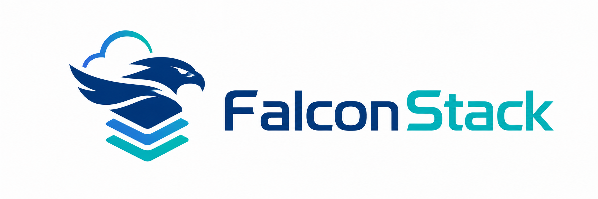

# FalconStack SaaS Growth & Retention Analysis

FalconStack is a synthetic B2B SaaS company serving customers across FinTech, DevTools, Cybersecurity, EdTech, and HealthTech. This project analyzes FalconStack's customer growth, recurring revenue, churn behavior, product usage, support burden, and segment investment opportunities.

The project is primarily a **data analyst portfolio project**. SQL, Excel, Power BI, Python, and a small XGBoost/FastAPI churn predictor are used as tools to answer business questions, validate data quality, and communicate recommendations.



## Executive Summary

FalconStack's acquisition engine worked through much of 2024, but growth was not sustainably healthy by year-end. Active customers peaked at **227 in August 2024** and fell to **142 in December 2024**, while customer churn rose from **16.48% in November 2024** to **36.82% in December 2024**.

Revenue retention also showed pressure. NRR stayed below 100% in October and November 2024, meaning expansion revenue did not fully offset contraction and churn. The main business issue is not initial demand; it is retention durability after acquisition.

## Stakeholder Questions

| Business Question | Answer |
| --- | --- |
| Is FalconStack's growth sustainable? | Not yet. Acquisition and MRR grew, but late-2024 retention deterioration weakened the customer base. |
| What is driving churn? | Churn is broad and appears linked to feature gaps, budget pressure, support issues, competitor pressure, and pricing concerns. |
| Are some customers riskier than others? | Yes. Higher-risk groups include DevTools, trial customers, Enterprise accounts, downgraded accounts, and customers with support friction. |
| Does product usage protect retention? | Usage is associated with retention, but only moderately. Engagement helps, but it does not fully explain churn. |
| Where should FalconStack invest? | Organic and Partner channels, plus FinTech, EdTech, and Cybersecurity, are stronger candidates. DevTools needs churn fixes before heavier investment. |

## Main Dashboards

### 1. Data Cleaning Dashboard


Validates the analysis foundation by comparing raw and cleaned data quality. Completeness, uniqueness, and documented issue reduction reached **100%**, while validity remained visible as a separate limitation.

### 2. Growth Sustainability Dashboard


Shows that growth momentum weakened late in 2024. MRR and customer count increased earlier, but churn and revenue loss began pulling the business backward.

### 3. Churn Diagnosis Dashboard


Explains churn patterns across reasons, plan tiers, cohorts, upgrades/downgrades, and early-life retention. Feature-related churn and late-2024 early churn are key warning signs.

### 4. Segment Investment Dashboard


Prioritizes segments by ARR share, churn rate, support burden, and usage. FinTech appears strongest, EdTech is stable, Cybersecurity is attractive but needs monitoring, and DevTools should be fixed before scaling.

## Key Insights

- 📉 **Retention became the growth constraint.** Active customers declined sharply after August 2024, with December 2024 showing the most severe churn spike.
- 💰 **Revenue quality weakened.** NRR below 100% means expansion revenue was not enough to cover churn and contraction losses.
- 🧩 **Churn has multiple causes.** Feature gaps, budget pressure, support experience, competition, and pricing all appear in churn reasons.
- 🚦 **Downgrades are a warning signal.** Customers who downgrade are more likely to churn later and should be monitored closely.
- 🧪 **Early churn needs attention.** Late-2024 signup cohorts show weaker early retention, pointing to onboarding or activation problems.
- 🏢 **Segment strategy should be selective.** FinTech and EdTech are stronger plays; DevTools and HealthTech require retention work before aggressive growth investment.

## Recommendations

1. **Prioritize retention before more acquisition spend.** Growth should focus on keeping and expanding existing customers, not only adding new logos.
2. **Improve onboarding for trial and new customers.** Early churn suggests customers need faster activation and clearer value realization in the first 30-90 days.
3. **Address product gaps behind feature-related churn.** Use churn feedback and feature-error patterns to prioritize roadmap fixes.
4. **Create a downgrade-save motion.** Treat downgrades as churn-risk triggers for customer success outreach.
5. **Segment investment by revenue and risk.** Continue investing in FinTech and EdTech, monitor Cybersecurity, and fix DevTools churn before scaling that segment.
6. **Use churn scoring as a support tool.** The XGBoost predictor can help prioritize accounts, but final decisions should remain tied to dashboard insights and business context.

## Project Workflow

```text
Raw Data
  -> Python ETL and data quality checks
  -> Cleaned analysis-ready CSVs
  -> Excel data cleaning dashboard
  -> SQL metric layer
  -> Power BI business dashboards
  -> XGBoost churn predictor add-on
```

## Repository Guide

| Folder | Purpose |
| --- | --- |
| `data/` | Raw and cleaned SaaS datasets for accounts, subscriptions, churn events, feature usage, and support tickets. |
| `ETL/` | Python notebook workflow for data cleaning and exploratory analysis. |
| `excel/` | Excel workbook and dashboard summarizing data quality improvements. |
| `sql/` | DuckDB-style SQL scripts for customer, retention, revenue, unit-economics, and segment metrics. |
| `dashboards/` | Final Excel and Power BI dashboard exports plus the Power BI workbook. |
| `churn_predictor/` | XGBoost model notebook, exported model files, and FastAPI scoring UI. |
| `Reusable_Python_Data/` | Small helper classes used for loading, profiling, plotting, and saving datasets. |

## Data Assets

| Dataset | Cleaned Rows | Business Use |
| --- | ---: | --- |
| Accounts | 537 | Customer profile, industry, country, referral source, plan, trial status, churn flag |
| Subscriptions | 5,309 | Subscription lifecycle, MRR/ARR, plan tier, renewals, upgrades, downgrades, churn |
| Feature Usage | 26,653 | Product engagement, duration, feature breadth, error behavior |
| Support Tickets | 1,996 | Support volume, response time, resolution time, satisfaction, escalations |
| Churn Events | 632 | Churn date, churn reason, refund, reactivation, upgrade/downgrade context |

## Tools Used

- **Python / pandas**: data cleaning, EDA, dataset preparation
- **Excel**: data quality dashboard
- **DuckDB SQL**: metric modeling and analytical views
- **Power BI**: final business dashboards
- **XGBoost**: churn classification model
- **FastAPI**: lightweight churn prediction UI

## Churn Predictor Add-On

The churn predictor trains an XGBoost classifier using account profile, subscription context, product usage, and support-ticket features. On the test set, it achieved **92% accuracy** with **82% F1-score for churned customers**.


This model is included as an operational extension of the analysis. It helps identify accounts that may need retention outreach, while the dashboards explain the broader business story and recommended actions.

## Core Takeaway

FalconStack does not have a demand problem; it has a retention-quality problem. The company should protect the existing customer base, improve early lifecycle activation, resolve feature and support pain points, and invest selectively in segments where revenue potential and churn risk are balanced.
