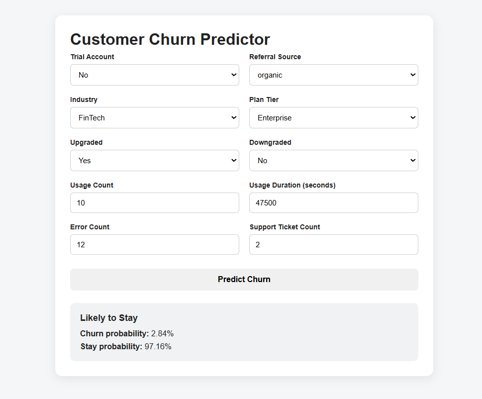

# FalconStack Churn Predictor

This folder contains the churn prediction add-on for the FalconStack SaaS growth and retention analysis. The model is secondary to the main analytics project: it turns the cleaned data and retention findings into a simple operational tool for estimating whether an account is likely to churn.



## Purpose

The predictor supports retention prioritization by scoring customers with account, subscription, product-usage, and support signals. It is designed to complement the dashboard insights, not replace the business analysis.

## Model Summary

| Item | Detail |
| --- | --- |
| Algorithm | XGBoost classifier |
| Training notebook | `xgboost_creator.ipynb` |
| Target | `churn_flag` |
| Test split | 20%, stratified, `random_state=42` |
| Accuracy | 92% |
| Churn-class precision | 86% |
| Churn-class recall | 79% |
| Churn-class F1 | 82% |

## Features Used

| Feature Group | Fields |
| --- | --- |
| Account profile | `is_trial`, `referral_source`, `industry` |
| Subscription context | `plan_tier`, `upgrade_flag`, `downgrade_flag` |
| Product usage | `usage_count`, `usage_duration_secs`, `error_count` |
| Support activity | `tickets_count` |

Categorical values are stored in `exported_model/xgb_churn_metadata.json` so the FastAPI app can rebuild the same category structure used during training.

## Folder Structure

```text
churn_predictor/
  README.md
  xgboost_creator.ipynb
  assets/
    churn_predictor_action.png
  exported_model/
    xgb_churn_predictor.json
    xgb_churn_metadata.json
  frontend/
    main.py
```

## Workflow

1. The notebook loads cleaned project datasets from `../data/cleaned/`.
2. Subscription, account, feature-usage, and support-ticket data are merged into a modeling table.
3. Missing modeling fields are handled, categorical fields are converted, and the data is split into train/test sets.
4. An XGBoost classifier is trained and evaluated.
5. The trained model and metadata are exported to `exported_model/`.
6. `frontend/main.py` serves a lightweight FastAPI UI for single-customer churn scoring.

## Run the Predictor

From the `churn_predictor/frontend` folder:

```powershell
uvicorn main:app --reload
```

Then open:

```text
http://127.0.0.1:8000
```

The app returns:

- Prediction label: `Likely to Churn` or `Likely to Stay`
- Churn probability
- Stay probability

## Notes

- The app currently uses the repository path configured in `frontend/main.py`
- The default classification threshold is `0.5` 
- For business use, scores should be paired with the dashboard findings: downgraded accounts, trial accounts, high-support accounts, and segments with elevated churn deserve closer review
