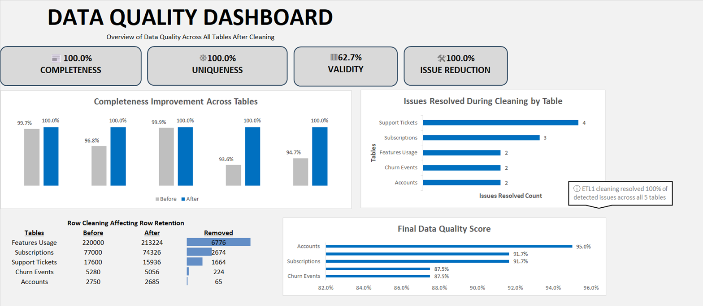
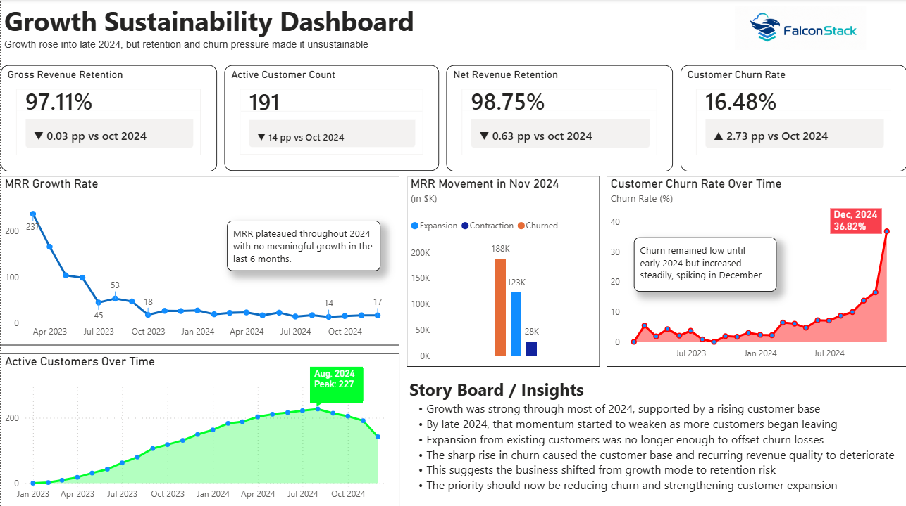
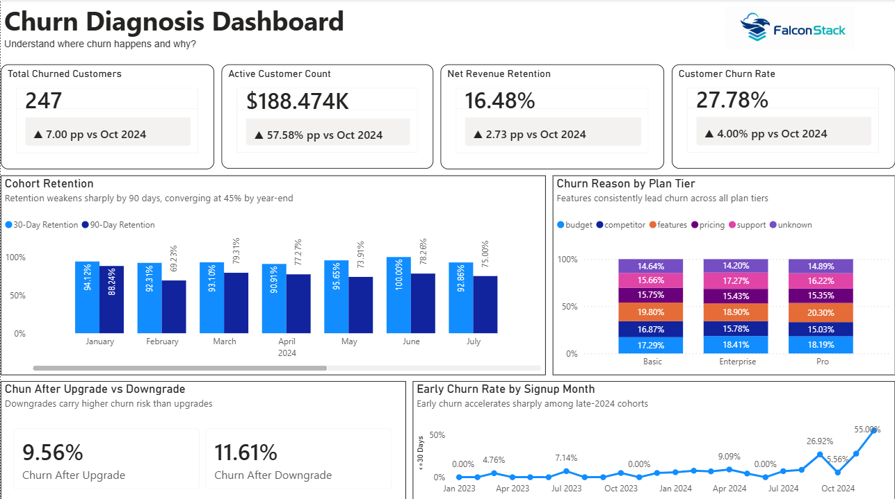
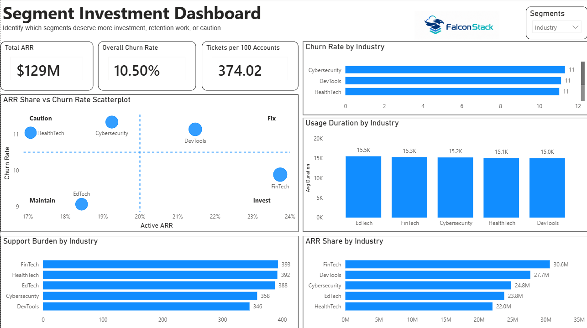

# Dashboards

This folder contains the dashboard layer of the FalconStack SaaS Growth and Retention analysis. The dashboards are split into two stages of the project:

- `data_cleaning_dashboard.png` was created in Excel to document and visualize the data cleaning process.
- `growth_sustainability_dashboard.png`, `churn_diagnosis.png`, and `segment_investment.png` were created in Power BI as the final analytical dashboards.
- `falconstack_growth_retention_dashboards.pbix` is the Power BI workbook used to build the final dashboard views.

Together, the dashboards tell the project story from data preparation to business interpretation: first, whether the data was clean enough to trust; then whether FalconStack's growth was sustainable; then why churn increased; and finally which customer segments deserve investment, retention work, or caution.

## 1. Data Cleaning Dashboard

The Excel data cleaning dashboard explains what happened before the cleaned datasets were used for the final analysis. It acts as the quality-control checkpoint for the project.

The top KPI cards summarize the final state of the cleaned data. Completeness reached 100%, uniqueness reached 100%, and issue reduction reached 100%, meaning the detected cleaning issues were resolved across the source tables. Validity is shown separately at 62.7%, which highlights that not every field or record met all validity expectations even after the main cleaning work was completed.

The dashboard then shows how completeness improved across the main tables. Before cleaning, some tables were already close to complete, while others had visible gaps. After cleaning, the tables shown in the chart were brought to 100% completeness. This makes the cleaning impact easy to see: the project did not simply assume the data was ready; it measured data quality before and after preparation.

The issues-resolved chart breaks the work down by table. Support tickets had the highest number of resolved issues, followed by subscriptions, then feature usage, churn events, and accounts. This is important because the final dashboards rely heavily on these tables to explain churn, retention, product usage, and revenue movement.

The row-cleaning section shows how many records were retained or removed during cleaning. Feature usage had the largest row reduction, followed by subscriptions and support tickets. Smaller removals happened in churn events and accounts. This gives context for the final dataset sizes and shows that cleaning involved filtering problematic or unusable rows, not just formatting fields.

The final data quality score chart summarizes the cleaned tables. Accounts scored highest, followed by subscriptions, support tickets, feature usage, and churn events. In story terms, this dashboard establishes the foundation: the final analysis is based on cleaned, checked, and documented datasets, while still being transparent about remaining validity limitations.

## 2. Growth Sustainability Dashboard

The Growth Sustainability Dashboard answers the first business question: was FalconStack's growth healthy, or was it starting to depend too heavily on acquisition while retention weakened?

The headline metrics show the state of the business near the end of the analysis period. Gross Revenue Retention is 97.11%, Net Revenue Retention is 98.75%, active customers are down to 191, and customer churn has risen to 16.48%. These numbers indicate that revenue retention is still close to stable, but the customer base is weakening.

The MRR growth rate chart shows the early growth story. FalconStack had much stronger MRR growth in 2023, but that momentum faded over time. By 2024, growth had flattened, with no meaningful acceleration in the last six months shown. The business was no longer expanding at the same pace.

The active customer trend adds another layer. Customer count increased through 2023 and into 2024, peaking at 227 in August 2024. After that peak, the customer base declined. This turns the dashboard from a simple growth report into a warning sign: acquisition and expansion had been working, but by late 2024 churn began pulling the company backward.

The MRR movement view for November 2024 shows expansion, contraction, and churned MRR side by side. Churned MRR is the largest visible movement, expansion is meaningful but not enough to fully offset losses, and contraction adds additional pressure. The churn-rate trend confirms the shift, showing churn staying relatively low earlier in the period before rising steadily and spiking in December 2024.

The story of this dashboard is that FalconStack grew, but the quality of that growth deteriorated. The company moved from growth mode into retention risk. The business priority should therefore shift toward reducing churn, protecting the customer base, and strengthening expansion from existing customers.

## 3. Churn Diagnosis Dashboard

The Churn Diagnosis Dashboard explains why the warning signs from the growth dashboard appeared. Instead of only showing that churn increased, it investigates where churn is happening and what patterns are connected to it.

The top KPI cards show a business under churn pressure. Total churned customers reached 247. The dashboard also highlights worsening churn-related indicators compared with October 2024, including a higher customer churn rate and weaker retention performance.

The cohort retention chart compares 30-day and 90-day retention by signup month. The important pattern is that short-term retention remains relatively high, but 90-day retention is weaker. By year-end, retention converges around much lower long-term levels. This suggests that many customers may initially stay engaged, but the product or customer experience is not consistently strong enough to keep them over a longer period.

The churn reason by plan tier chart shows that churn is not isolated to one plan. Reasons such as features, budget, competitor pressure, pricing, support, and unknown causes appear across Basic, Enterprise, and Pro customers. Feature-related churn is especially prominent across plan tiers, which points to a product capability or expectation gap rather than a single segment issue.

The upgrade-versus-downgrade section shows that churn after downgrade is higher than churn after upgrade. This means downgrades may be an early warning signal: when customers reduce their plan, they are more likely to leave later. That makes downgraded customers a useful group for retention outreach.

The early churn rate by signup month shows one of the clearest warning signals. Early churn stayed relatively low for much of the period, but it accelerated sharply among late-2024 signup cohorts. This means the churn problem is not only coming from old customers leaving; newer customers are also becoming less likely to survive the early lifecycle.

The story of this dashboard is that churn is broad, accelerating, and tied to both product value and customer lifecycle risk. The next business move should be to address feature gaps, identify downgrade risk earlier, and improve onboarding or activation for newer cohorts.

## 4. Segment Investment Dashboard

The Segment Investment Dashboard turns the diagnosis into action. It asks which industries or customer groups deserve more investment, which ones should be maintained, and which ones need fixes before additional growth spend.

The headline metrics show the overall business context: total ARR is $129M, overall churn rate is 10.50%, and support burden is 374.02 tickets per 100 accounts. These KPIs frame the segment analysis around revenue, churn, and operational load.

The ARR share versus churn rate scatterplot is the main decision view. It separates segments into strategic positions. HealthTech appears as a lower-ARR, higher-churn segment marked for investment consideration. Cybersecurity has strong ARR share but also elevated churn, making it attractive but still in need of attention. DevTools sits in the high-ARR and high-churn area, making it a fix-first segment before heavier investment. EdTech has lower churn and a more stable position, making it a maintain segment. FinTech carries the largest ARR share and appears in the lower-churn area, making it one of the stronger segments for continued focus.

The churn rate by industry chart shows that Cybersecurity, DevTools, and HealthTech have churn around the same elevated level. This confirms that high churn is not limited to only one industry. The usage-duration chart shows fairly similar usage duration across industries, which suggests that churn differences may not be explained by usage time alone.

The support burden chart adds an operational lens. FinTech, HealthTech, EdTech, Cybersecurity, and DevTools all generate substantial support demand, with FinTech and HealthTech at the top. This matters because a segment can look attractive from an ARR perspective but still require high service effort.

The ARR share by industry chart shows where revenue is concentrated. FinTech contributes the most ARR, followed by DevTools, Cybersecurity, EdTech, and HealthTech. When combined with churn and support burden, this helps distinguish between segments that are valuable and stable, valuable but risky, or lower-value and operationally demanding.

The story of this dashboard is that investment should not be based on ARR alone. FinTech looks like a strong segment because it contributes the most ARR with comparatively better churn positioning. DevTools has high ARR but needs churn fixes. Cybersecurity has attractive revenue potential but should be monitored because churn is elevated. EdTech looks more stable and worth maintaining. HealthTech may need a clearer retention or value-improvement plan before major investment.

## Overall Dashboard Story

The dashboards are meant to be read in sequence.

First, the Excel cleaning dashboard proves that the analysis starts from cleaned and documented data. Then the Growth Sustainability Dashboard shows that FalconStack's growth slowed and retention pressure increased. The Churn Diagnosis Dashboard explains that churn is broad, tied to feature expectations, downgrades, and weaker early-life retention. Finally, the Segment Investment Dashboard translates those findings into business action by showing where FalconStack should invest, where it should maintain, and where it should fix retention before scaling further.

In short, the dashboard story is:

1. Clean the data and verify the foundation.
2. Identify that growth is becoming less sustainable.
3. Diagnose the churn patterns behind that slowdown.
4. Prioritize customer segments based on revenue, churn, usage, and support burden.
